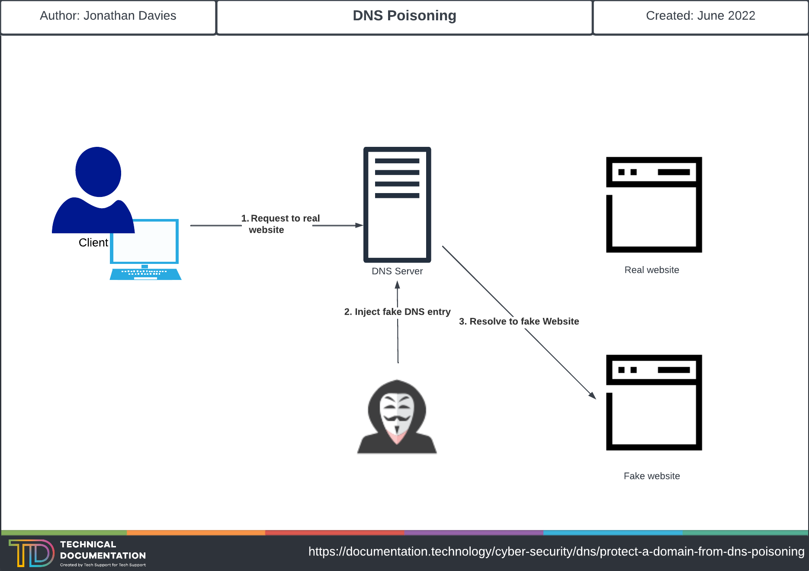

# Protect a Domain from DNS Poisoning

## What is DNS Poisoning?

DNS Poisoning or DNS Spoofing is a form of hacking in which a hacker may corrupt your DNS cache in order to return a false location for which domain you are trying to resolve. For example, let's say you wanted to browse your bank at https://www.lloydsbank.com/, this would return the public IP address for it to route too: 104.86.138.137. What a hacker could do, is "poison" your DNS cache and have it browse to a completely different IP address, example: 101.18.1.15. The address you go to may look identical to the Lloyd's Bank website, however when you go to sign in and type your Username and Password - they will have visibility of this. Below you can see an example diagram of how this may work:

### What are the risks of DNS Poisoning?

Here's a list of risks that DNS Poisoning may pose:
- Theft of data
- Malware Infection
- Avoiding Security Updates

---

## How do I protect myself from DNS Poisoning?

There are a couple of ways you can prevent yourself from being affected by DNS Poisoning, here a few of them:

### DNSSEC

DNSSEC (Domain Name System Security Extension) will append a label to the DNS entry in order to verify that the request if authentic and in turn, stopping criminals from redirecting you to a malicious website.

### End to End Encryption

End to End Encryption of your data that is sent out from your network, will prevent criminals from accessing the DNS data that is within the packets and stopping them from redirecting you to a malicious website. A VPN like NordVPN can help you achieve this.

### HTTPS

Ensuring the website you are visiting is encrypted by an SSL Certificate that can be verified by a third party certificate authority. Look for the secure bell icon at the top left of your browser - if this is verified it'll usually be green or have a padlock. If it's insecure, the padlock will be unlocked or it'll have a red X next to it. Usually web browsers normally warn you of insecure websites and warn you before proceeding, too.

### End user training

- Ensuring that uses don't click any links that they don't recognise. 
- Regularly scanning your device for malware
- Flushing of DNS Cache regularly - could be achieved by a group policy logon script